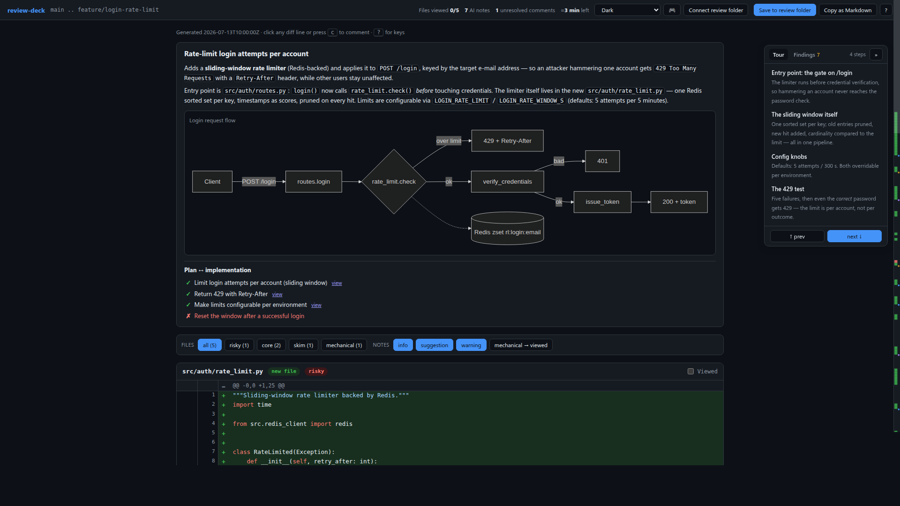
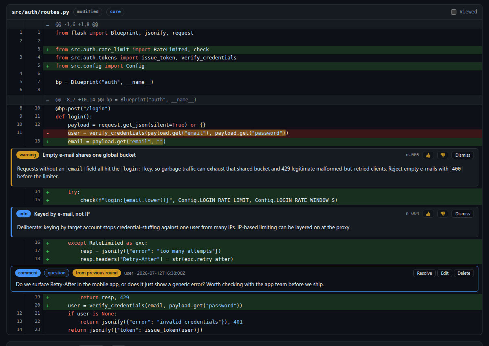
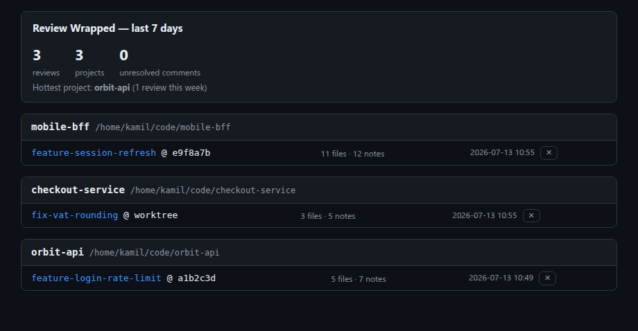

# review-deck

A Claude Code plugin that turns any git diff into an **interactive, self-contained HTML code review page** — AI notes anchored to the lines they explain, inline commenting, a guided tour, and a two-way loop: your comments become Claude's next work queue.

AI generates a lot of code; you read more code than ever. Reading raw diffs in a terminal is exhausting — review-deck gives you a real review UI where the AI explains *why* each part of the change exists.



*The pages in these screenshots are a fictional demo review, generated with the real pipeline.*

## Install

```bash
git clone https://github.com/cmvl133/cc-review-plugin.git && cd cc-review-plugin
./install.sh        # global, symlink — 'git pull' is your update
```

Requirements: `git`, `python3` (stdlib only — no pip installs), any modern browser.

<details>
<summary>Other install options</summary>

```bash
./install.sh --local [DIR]   # only for one project (default: current git repo)
./install.sh --copy          # copy instead of symlink; re-run to update
./install.sh uninstall [--local [DIR]]
claude --plugin-dir /path/to/cc-review-plugin   # one session only
```

Symlink installs track this checkout live (restart the session after pulling); `--copy` is for when the checkout may move or you want a frozen version. The script is idempotent and refuses to overwrite anything at the target that isn't review-deck.

Verify with `claude plugin details review-deck@skills-dir`: you should see the `/review`, `/respond`, `/hub` and `/chat` commands, the `code-reviewer` agent, and the `review-deck` skill.

</details>

## `/review` — generate the review page

```
/review                                  # staged changes, or working tree vs HEAD
/review main...HEAD                      # a range
/review abc1234                          # a single commit
/review origin/main...HEAD --as-reviewer # someone else's change (see below)
```

Claude assembles a context brief (your plan, decisions, stated intent) and produces:

- an **overview** — what the change is, why it exists, where to start reading — with **mermaid diagrams** when there's a flow worth drawing;
- explanatory **`info` notes**, written by the author session (it knows why each piece exists);
- critique **`warning`/`suggestion` notes** from a fresh-eyes `code-reviewer` subagent that never sees your chat — findings go straight to a draft file, no JSON through the conversation;
- a deterministic build: `build_review.py` merges the drafts and renders `review.html`, which opens in your browser.



With `--as-reviewer`, Claude stops assuming it authored the diff: it gathers context from the MR/PR description, commit messages and ticket references, and writes the explanatory notes in a neutral reviewer voice — for reviewing a colleague's MR you checked out.

### Your attention is budgeted

AI-assisted work produces *a lot* of diff, so the page helps you spend reading time where it matters:

- **Triage** — every file classified `risky` / `core` / `skim` / `mechanical` (with a reason), sorted hardest-first; mechanical files come collapsed and one click marks them all viewed. Changed logic with no test in the diff gets an **untested** badge.
- **Guided tour** — a sticky sidebar walking the diff in narrative order (entry point → core → periphery), deep-linking each step.
- **Plan ↔ implementation checklist** — every plan item ✓ done / ≈ partial / ✗ missing. Catches what the change *silently didn't do*.
- **Reading-time estimate** in the header, weighted by triage and ticking down as you mark files viewed.

### In the browser

- **Comment on any diff line** (click or `c`) — with a type (`fix` / `question` / `nit` / `discuss`) so `/respond` knows whether to patch, answer, or discuss.
- **Dismiss an AI note** and neither `/respond` nor future review rounds will act on it or re-raise it. **👍/👎** on notes teaches the next round's reviewers what you consider signal vs noise.
- **Save comments straight into the review folder** (Chromium: one-time folder pick, then automatic) or **Export**/**Copy as Markdown** elsewhere (Firefox, Safari). Everything is also buffered in `localStorage`, so closing the tab loses nothing.
- **Word-level highlighting** inside modified line pairs; a **minimap** with change density and note/comment markers; a **findings digest** tab listing every note by severity with "handled" checkboxes.
- **16 themes** (dark, light, solarized, Dracula, Nord, Gruvbox, Catppuccin, Tokyo Night, Rosé Pine, … plus custom color pickers), persisted.
- **Arcade mode** 🎮 — entirely optional, entirely silly: XP for reviewing, levels, confetti, and a rubber duck 🦆 that waddles along the diff and quacks when you comment.

| Key | Action | Key | Action |
|-----|--------|-----|--------|
| `j` / `k` | next / previous hunk | `c` | comment on focused line |
| `n` / `p` | next / previous AI note | `v` | mark file viewed |
| `Shift+J` / `K` | next / previous file | `]` | mark viewed + jump to next unviewed |
| `?` | help | | |

## `/respond` — close the loop

Reads your exported comments, replies to each unresolved one in-chat, proposes/applies code changes where a comment asks for one (with your confirmation), and offers to run `/review` again. Unresolved comments carry over to the next round's page, flagged **"from previous round"**.

## `/hub` — every review, one page

Each `/review` registers its page in a local registry; `/hub` rebuilds a static `index.html` of all reviews across all your projects — grouped by repo, with note counts, unresolved-comment badges and last activity. No server, no daemon; entries whose page was deleted prune themselves.



It opens with **Review Wrapped** — your last 7 days at a glance. Arcade players see their XP level there too.

<details>
<summary>Optional GitLab integration (works with self-hosted)</summary>

The hub can list every open MR where you're assignee or reviewer — fetched at rebuild time straight from the GitLab API (stdlib urllib, no dependencies). Configure once in `~/.local/share/review-deck/config.json`:

```json
{"gitlab": {"url": "https://gitlab.your.company", "token_env": "GITLAB_TOKEN"}}
```

`token` inline also works; `token_env` keeps the secret out of the file. `"insecure": true` skips TLS verification for self-signed setups. No config → no section, no network.

</details>

## `/chat` — talk to the session that wrote it (POC)

Every review captures the **id of the Claude Code session that generated it**. `/chat` starts a small local server (127.0.0.1, stdlib only) with a browser chat UI: pick any review — from any repo — and ask its authoring session directly ("why did you pick this pattern?"), with its full context. While it runs, the hub shows a **Chat** button next to every review.

Resumed sessions get read-only tools (`Read`, `Grep`, `Glob`) — they can inspect and discuss, not edit. This is the one opt-in component that is a server; stop it with `pkill -f deck_chat.py`.

## Plug in your own tooling

review-deck is a **sink for any pipeline that can write JSON**: workflows, git hooks, CI jobs or linter wrappers drop note fragments into `.code-review/<branch>/contrib/`, and the next `/review` merges them into the page with a per-tool source badge. Project defaults (diff base, excludes, custom reviewer agents) live in a committed `.claude/review-deck.json`. Full contract, validator and adapter examples: [INTEGRATIONS.md](INTEGRATIONS.md).

## The review directory

Everything lives under `.code-review/` at the repo root (auto-gitignored):

```
.code-review/
└── <branch-slug>/               # branch name, slugified
    └── <round>/                 # short commit hash, or "worktree" for uncommitted diffs
        ├── changes.patch        # the exact diff that was reviewed
        ├── review.html          # the page (self-contained, zero network requests)
        ├── notes.*.json         # working drafts (conductor + one per reviewer agent)
        ├── notes.ai.json        # merged AI notes — machine-readable source of truth
        ├── notes.ai.md          # the same notes, human-readable
        └── comments.user.md     # your comments, exported from the page
```

`comments.user.md` is plain, pleasant markdown — one section per comment with the anchored line quoted, author, timestamp and resolved status.

<details>
<summary>Design choices (where the spec left room)</summary>

- **The repo root is the plugin**: `.claude-plugin/plugin.json` sits at the top level next to `commands/`, `agents/` and `skills/`, so the checkout can be symlinked or `--plugin-dir`'d directly.
- **AI notes are rendered into the HTML by the script** (server-side, visible without JS); **user comments are rendered client-side** from an embedded JSON blob merged with `localStorage` — the page is the comment editor, so it owns that state. Previous-round unresolved comments ride in via that blob, flagged and still editable/resolvable.
- **Notes anchor to hunk index (1-based) + exact line content**, with whitespace-stripped and unique-substring fallbacks, then a cross-hunk search; failures render "unanchored" at the file top, never dropped.
- **Determinism**: the script generates no timestamps or randomness; the default review id is a hash of the patch, so re-running on the same diff produces identical bytes and preserves your buffered comments.
- **Mermaid is the one vendored dependency**: diagrams need a real renderer, so `assets/mermaid.min.js` (pinned, from jsDelivr) is inlined into pages that contain diagrams (~2.6 MB; diagram-free pages stay small) — keeping the zero-network-requests guarantee. Everything else stays hand-rolled.
- **The hub is a static page, not a service**: `build_hub.py` keeps `registry.json` + `index.html` under `$XDG_DATA_HOME/review-deck/` and rebuilds on demand; dead entries self-prune. Registration is local metadata only (paths and counts — no code leaves your machine).
- **Syntax highlighting** is a ~120-line per-line tokenizer (keywords / strings / comments / numbers) with language families picked by file extension. Multi-line block comments don't carry highlight state across lines — a deliberate simplicity trade-off.
- The raw diff is kept as `changes.patch` in each round dir (not in the spec's file list, but essential for reproducing the page and for `/respond` context).
- A body line consisting solely of `---` inside a comment is escaped on export (`\---`) so it can't terminate the section early.

</details>

<details>
<summary>Limitations</summary>

- File System Access API is Chromium-only; everyone else uses Export/Copy.
- The embedded tokenizer is approximate by design — a reading aid, not a compiler.
- Comment bodies are treated as plain text in the page and parsed leniently from `comments.user.md`.
- A page with diagrams carries the inlined mermaid renderer (~2.6 MB). If a diagram's source fails to parse, mermaid renders its inline error — fix the source in `notes.ai.json` and re-run the build.
- The hub links reviews via `file://`, so it lists reviews from this machine only.

</details>
